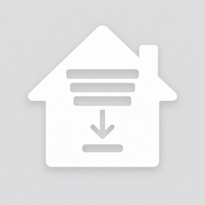

<p align="center">
  
</p>

# Nice Blinds Controller - Home Assistant Custom Integration
A Home Assistant custom integration for controlling blinds and motors via HTTP/network controllers that implement the Nice protocol.

## Features
- **HTTP Controller Support**: Connect to Nice network/HTTP controllers with automatic device discovery
- **Automatic Device Discovery**: Finds all devices from your Nice controller
- **Full Control**: Open, close, stop, and position control (0-100%)
- **Real-time Position Tracking**: Reads actual positions from the controller
- **Controller Group Support**: Automatically imports enabled groups from your Nice controller for true hardware-level synchronization
- **UI Configuration**: Easy setup through Home Assistant interface
- **CLI Tools**: Standalone command-line interface for direct control (see [CLI Tools](#cli-tools-standalone) below)

## Requirements

- Home Assistant (tested on 2024.1+)
- Nice HTTP/network controller (e.g., IT4WiFi, MyNice, or compatible)
- Network access to your Nice controller

## Installation

### HACS (Recommended)

1. Ensure [HACS](https://hacs.xyz/) is installed in your Home Assistant instance
2. Open HACS in your Home Assistant instance
3. Click the **three dots (⋮)** in the top right corner
4. Select **"Custom repositories"**
5. Add this repository:
   - **Repository**: `laberge/nice-blinds-controller`
   - **Category**: `Integration`
6. Click **"Add"**
7. Find "Nice Blinds Controller" in HACS
8. Click **"Download"**
9. Restart Home Assistant

### Manual Installation

1. Copy the `custom_components/blinds_control` directory to your Home Assistant `config/custom_components/` directory
2. Restart Home Assistant

## Configuration

### HTTP Controller Setup

#### Setup Steps

1. Go to **Settings** → **Devices & Services**
2. Click **+ Add Integration**
3. Search for "Nice Blinds Controller"
4. Enter your controller details:
   - **Base URL**: Your controller's IP address (e.g., `http://192.168.1.100`)
   - **Username**: Controller username
   - **Password**: Controller password
   - **Timeout**: Request timeout in seconds (default: 10)
5. Click **Submit**
6. The integration will automatically discover all connected devices
7. **Select devices** you want to add to Home Assistant
8. **Review controller groups** - The integration discovers groups configured on your Nice controller:
   - Groups are read directly from the controller (e.g., "Office", "Sunroom", "Kitchen")
   - Create and manage groups in your controller's web interface
   - Groups execute commands at the hardware level (truly simultaneous)
9. Click **Submit** to complete setup

**Group entities** appear as separate cover entities. They send commands to your controller's native groups for instant, simultaneous control of all member devices. Create and edit groups in the controller web UI; then use the integration's **Options → Refresh Devices & Groups** flow to pull the latest list into Home Assistant.

### Refreshing Devices & Groups

When you add new devices or create new groups on your controller:

1. Go to **Settings** → **Devices & Services**  
2. Find **Nice Blinds Controller**
3. Click **Configure** (gear icon)
4. Select **"Refresh Devices & Groups"**
5. Click **"Refresh Now"**

The integration will re-discover everything from the controller and reload automatically - no need to reinstall!

#### Supported Controllers

This integration works with Nice controllers that use the following API format:
```
http://controller-ip/cgi/devcmd.xml?adr=1&ept=0F&cmd=03
```

Command codes:
- `cmd=02` - Stop
- `cmd=03` - Open/Up
- `cmd=04` - Close/Down

Compatible with:
- Nice IT4WiFi
- Nice MyNice controllers
- Other Nice network controllers with HTTP API

## Usage

Once configured, your blinds will appear as cover entities in Home Assistant. You can:

- **Dashboard Control**: Use open/close/stop buttons and position slider
- **Automations**: Trigger based on time, sun position, or other events
- **Voice Control**: Use with Alexa, Google Home, or Siri
- **Scenes & Scripts**: Include in complex automation scenarios

### Example Automations

#### Open blinds at sunrise
```yaml
automation:
  - alias: "Open blinds at sunrise"
    trigger:
      platform: sun
      event: sunrise
      offset: "00:15:00"  # 15 minutes after sunrise
    action:
      service: cover.open_cover
      target:
        entity_id: cover.living_room_blinds
```

#### Close blinds when it gets hot
```yaml
automation:
  - alias: "Close blinds when hot"
    trigger:
      platform: numeric_state
      entity_id: sensor.outdoor_temperature
      above: 28
    action:
      service: cover.close_cover
      target:
        entity_id: cover.living_room_blinds
```

#### Set blinds to 50% at sunset
```yaml
automation:
  - alias: "Partial close at sunset"
    trigger:
      platform: sun
      event: sunset
    action:
      service: cover.set_cover_position
      target:
        entity_id: cover.living_room_blinds
      data:
        position: 50
```

## Troubleshooting

### CLI Troubleshooting

**Group commands not working:**
1. List groups to verify they exist on controller:
   ```bash
   blinds list-groups
   ```
2. Ensure group is configured in controller's web interface: `http://192.168.10.235/grp_list.htm`
3. Group names are case-insensitive but must match controller exactly
4. Try individual device commands first to verify connectivity:
   ```bash
   blinds status
   ```

**Device not found errors:**
- Run `blinds list` to see exact device names from controller
- Device names are case-insensitive but must match exactly

**Password not configured:**
- Set environment variable: `export BLINDS_PASS="your_password"`
- Or edit the `blinds` script and set `PASSWORD = "your_password"`
- Add to `~/.zshrc` or `~/.bashrc` to persist

**Connection timeout:**
- Verify controller is reachable: `ping 192.168.10.235`
- Check URL matches your controller IP in the `blinds` script
- Ensure controller web interface is accessible

### Enable Debug Logging (Home Assistant)

To see detailed debug information during setup and operation, add this to your `configuration.yaml`:

```yaml
logger:
  default: info
  logs:
    custom_components.blinds_control: debug
```

Then restart Home Assistant. Debug logs will show HTTP requests, device discovery details, and error information.

### HTTP Controller Issues

**Integration not found:**
- Restart Home Assistant after installation
- Clear browser cache (Ctrl+Shift+R or Cmd+Shift+R)
- Check logs: Settings → System → Logs

**Cannot connect to controller:**
- Verify controller IP address and network connectivity
- Check username and password
- Ensure controller's web interface is accessible from Home Assistant

**No devices found:**
- Verify devices are configured in your Nice controller
- Check controller's device list is accessible at `/cgi/devlst.xml`
- Review Home Assistant logs for parsing errors
- Enable debug logging to see XML response

**Position not updating:**
- Integration polls controller for real positions
- Check Home Assistant logs for polling errors
- Verify network connectivity to controller
- Move a blind manually to verify position updates

## Advanced Configuration

### Multiple Controllers

You can add multiple controllers by adding the integration multiple times. Each instance will discover and manage its own set of devices.

### Position Tracking

The integration reads **real-time positions** directly from the controller via polling. Position is automatically synchronized with the physical blind state, including manual movements via remote control.

## Nice Protocol Information

This integration uses the Nice HTTP/Network protocol with XML-based device communication:
- Device list: `/cgi/devlst.xml`
- Commands: `/cgi/devcmd.xml?adr=X&ept=X&cmd=X`
- Compatible with modern Nice controllers with web interface and network API

## Support

For issues and feature requests, please visit the [GitHub Issues](https://github.com/laberge/nice-blinds-controller/issues) page.

## License

Released under the MIT License. See the `LICENSE` file for details.

## CLI Tools (Standalone)

Control your blinds directly from the command line without Home Assistant. Great for testing and automation scripts.

### Individual Control
```bash
# Control single blinds with friendly device names
blinds open "MBA 3"
blinds close "Kitchen 1"
blinds stop "Office 1"
blinds status              # Show all devices
blinds list                # List all available devices
```

### Group Control
```bash
# Control multiple blinds simultaneously using controller's native groups
blinds list-groups         # List all groups from controller
blinds open-group "Office"   # Opens all office blinds instantly (hardware-synchronized)
blinds close-group "Sunroom" # Closes all sunroom blinds instantly
blinds stop-group "Kitchen"  # Stops all kitchen blinds

# Groups are configured in your Nice controller's web interface
```

### Quick Setup
```bash
./setup_blinds_cli.sh
```

### Features
- ✅ Control blinds using friendly device names
- ✅ **Native group commands** - Uses controller's hardware groups for true simultaneous execution
- ✅ **Instant group control** - All devices execute at exactly the same time
- ✅ **Status display** - View individual devices and controller groups
- ✅ Dotfiles integration support
- ✅ Secure password management (environment variables, keychain, password managers)

### Group Configuration

Groups are configured directly in your **Nice controller's web interface**:

1. Open your controller's web UI: `http://[contoller-ip]/grp_list.htm`
2. Create and manage groups
3. Groups are instantly available to the CLI (no configuration files needed!)

**List available groups:**
```bash
./blinds list-groups
```

### Documentation
- [Quick Start Guide](QUICK_START.md) - Get started in 30 seconds
- [CLI Documentation](BLINDS_CLI_README.md) - Detailed usage and examples
- [Dotfiles Setup](DOTFILES_SETUP.md) - Integration with your dotfiles workflow

### Example Usage

```bash
# List all controller groups
blinds list-groups

# Morning routine - open all sunroom blinds (truly simultaneous)
blinds open-group "Sunroom"

# Afternoon - close office blinds during presentation
blinds close-group "Office"

# Evening - use a custom "all" group you created on controller
blinds close-group "All Blinds"

# Check status of all devices and controller groups
blinds status
```

The `status` command displays:
1. **Individual Device Status** - Each blind's current state, position, and ID
2. **Controller Groups** - All groups configured on your Nice controller

**Advantages of controller groups:**
- ⚡ True hardware-level simultaneous execution
- 🎯 No delays or sequential processing needed
- 🔄 Automatically synced when you edit groups on the controller
- ✅ 100% reliable operation

## Disclaimer

This is an unofficial integration. Nice is a trademark of Nice S.p.A. This project is not affiliated with or endorsed by Nice S.p.A.
