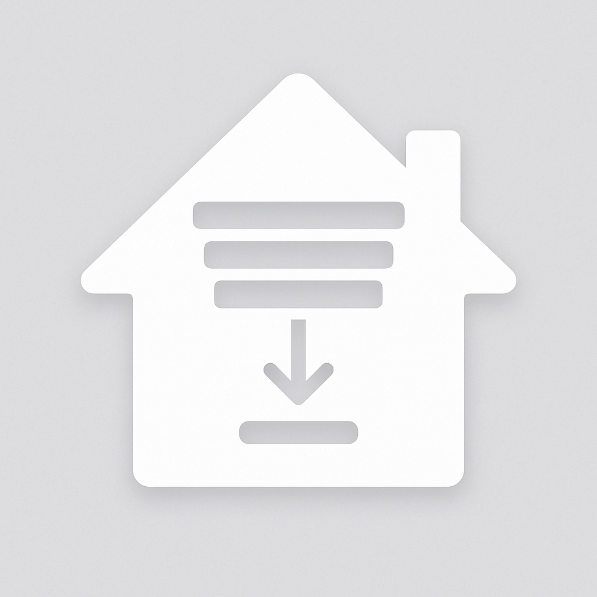

<p align="center">
  
</p>

# Nice Blinds Controller - Home Assistant Custom Integration

A Home Assistant custom integration for controlling Nice blinds and motors via HTTP/network controllers.

## Features

- **HTTP Controller Support**: Connect to Nice network/HTTP controllers with automatic device discovery
- **Automatic Device Discovery**: Finds all devices from your Nice controller
- **Full Control**: Open, close, stop, and position control (0-100%)
- **Real-time Position Tracking**: Reads actual positions from the controller
- **Group Support**: Create groups during setup to control multiple blinds together
- **UI Configuration**: Easy setup through Home Assistant interface
- **CLI Tools**: Standalone command-line interface for direct control (see [CLI Tools](#cli-tools-standalone) below)

## CLI Tools (Standalone)

Control your blinds directly from the command line without Home Assistant!

```bash
# Simple, friendly device names
blinds open "MBA 3"
blinds close "Kitchen 1"
blinds stop "Office 1"
blinds list
```

**Quick Setup:**
```bash
./setup_blinds_cli.sh
```

**Features:**
- Control blinds using friendly device names
- Dotfiles integration support
- Batch operations for multiple blinds
- Secure password management (environment variables, keychain, password managers)

**Documentation:**
- [Quick Start Guide](QUICK_START.md) - Get started in 30 seconds
- [CLI Documentation](BLINDS_CLI_README.md) - Detailed usage and examples
- [Dotfiles Setup](DOTFILES_SETUP.md) - Integration with your dotfiles workflow

## Requirements

- Home Assistant (tested on 2024.1+)
- Nice HTTP/network controller (e.g., IT4WiFi, MyNice, or compatible)
- Network access to your Nice controller

## Installation

### HACS (Recommended)

1. Ensure [HACS](https://hacs.xyz/) is installed in your Home Assistant instance
2. Open HACS in your Home Assistant instance
3. Go to "Integrations"
4. Click the three dots in the top right and select "Custom repositories"
5. Add this repository URL: `https://github.com/laberge/nice-blinds-controller`
6. Select "Integration" as the category
7. Click "Install"
8. Restart Home Assistant

### Manual Installation

1. Copy the `custom_components/blinds_control` directory to your Home Assistant `config/custom_components/` directory
2. Restart Home Assistant

## Configuration

### HTTP Controller Setup

#### Setup Steps

1. Go to **Settings** → **Devices & Services**
2. Click **+ Add Integration**
3. Search for "Nice Blinds Controller"
4. Enter your controller details:
   - **Base URL**: Your controller's IP address (e.g., `http://192.168.1.100`)
   - **Username**: Controller username
   - **Password**: Controller password
   - **Timeout**: Request timeout in seconds (default: 10)
5. Click **Submit**
6. The integration will automatically discover all connected devices
7. **Select devices** you want to add to Home Assistant
8. **Configure groups** (optional) to control multiple blinds together
9. Click **Submit** to complete setup

#### Supported Controllers

This integration works with Nice controllers that use the following API format:
```
http://controller-ip/cgi/devcmd.xml?adr=1&ept=0F&cmd=03
```

Command codes:
- `cmd=02` - Stop
- `cmd=03` - Open/Up
- `cmd=04` - Close/Down

Compatible with:
- Nice IT4WiFi
- Nice MyNice controllers
- Other Nice network controllers with HTTP API

## Usage

Once configured, your blinds will appear as cover entities in Home Assistant. You can:

- **Dashboard Control**: Use open/close/stop buttons and position slider
- **Automations**: Trigger based on time, sun position, or other events
- **Voice Control**: Use with Alexa, Google Home, or Siri
- **Scenes & Scripts**: Include in complex automation scenarios

### Example Automations

#### Open blinds at sunrise
```yaml
automation:
  - alias: "Open blinds at sunrise"
    trigger:
      platform: sun
      event: sunrise
      offset: "00:15:00"  # 15 minutes after sunrise
    action:
      service: cover.open_cover
      target:
        entity_id: cover.living_room_blinds
```

#### Close blinds when it gets hot
```yaml
automation:
  - alias: "Close blinds when hot"
    trigger:
      platform: numeric_state
      entity_id: sensor.outdoor_temperature
      above: 28
    action:
      service: cover.close_cover
      target:
        entity_id: cover.living_room_blinds
```

#### Set blinds to 50% at sunset
```yaml
automation:
  - alias: "Partial close at sunset"
    trigger:
      platform: sun
      event: sunset
    action:
      service: cover.set_cover_position
      target:
        entity_id: cover.living_room_blinds
      data:
        position: 50
```

## Troubleshooting

### Enable Debug Logging

To see detailed debug information during setup and operation, add this to your `configuration.yaml`:

```yaml
logger:
  default: info
  logs:
    custom_components.blinds_control: debug
```

Then restart Home Assistant. Debug logs will show HTTP requests, device discovery details, and error information.

### HTTP Controller Issues

**Integration not found:**
- Restart Home Assistant after installation
- Clear browser cache (Ctrl+Shift+R or Cmd+Shift+R)
- Check logs: Settings → System → Logs

**Cannot connect to controller:**
- Verify controller IP address and network connectivity
- Check username and password
- Ensure controller's web interface is accessible from Home Assistant

**No devices found:**
- Verify devices are configured in your Nice controller
- Check controller's device list is accessible at `/cgi/devlst.xml`
- Review Home Assistant logs for parsing errors
- Enable debug logging to see XML response

**Position not updating:**
- Integration polls controller for real positions
- Check Home Assistant logs for polling errors
- Verify network connectivity to controller
- Move a blind manually to verify position updates

## Advanced Configuration

### Multiple Controllers

You can add multiple controllers by adding the integration multiple times. Each instance will discover and manage its own set of devices.

### Position Tracking

The integration reads **real-time positions** directly from the controller via polling. Position is automatically synchronized with the physical blind state, including manual movements via remote control.

## Nice Protocol Information

This integration uses the Nice HTTP/Network protocol with XML-based device communication:
- Device list: `/cgi/devlst.xml`
- Commands: `/cgi/devcmd.xml?adr=X&ept=X&cmd=X`
- Compatible with modern Nice controllers with web interface and network API

## Support

For issues and feature requests, please visit the [GitHub Issues](https://github.com/laberge/nice-blinds-controller/issues) page.

## Contributing

Contributions are welcome! Especially:
- Additional Nice controller model support
- Enhanced features and functionality
- Code improvements and bug fixes
- Documentation improvements

## License

This project is open source. Feel free to modify and distribute as needed.

## Disclaimer

This is an unofficial integration. Nice is a trademark of Nice S.p.A. This project is not affiliated with or endorsed by Nice S.p.A.
