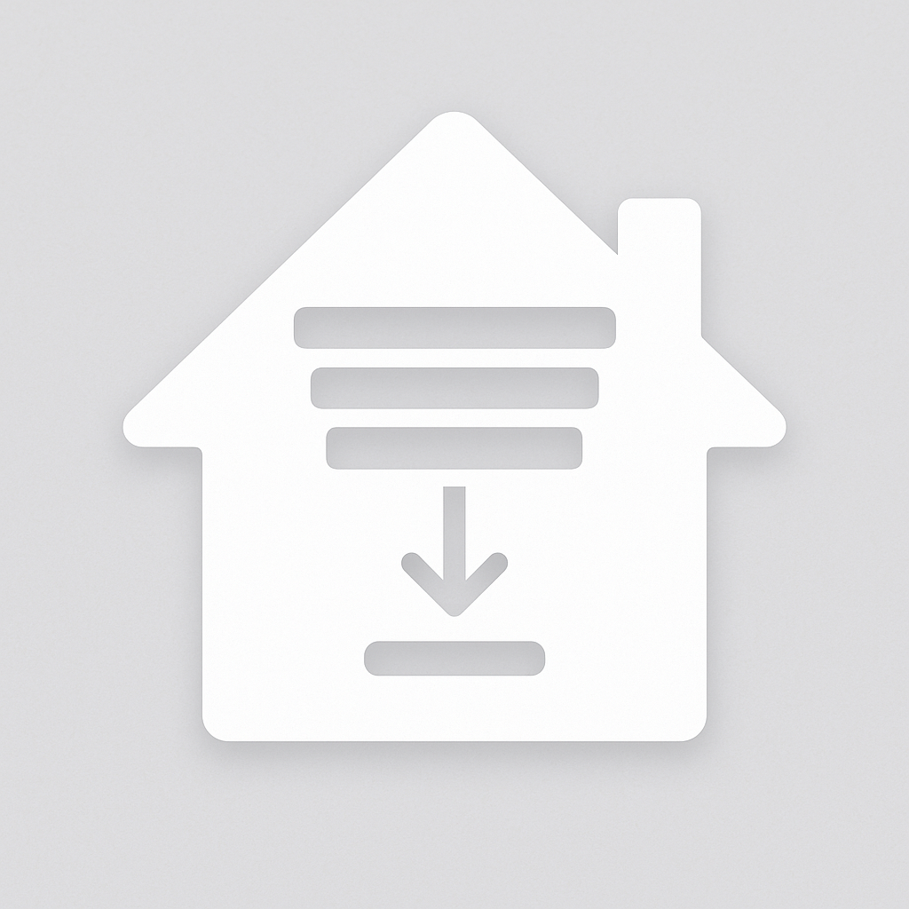

<p align="center">
  
</p>

# Nice Blinds Controller — Home Assistant Custom Integration

A Home Assistant custom integration for controlling blinds and shade motors through Nice HTTP/network controllers (IT4WiFi, MyNice, and compatible).

## Features

- **Automatic discovery** of all devices from your Nice controller
- **Open / close / stop** and **set position** (0–100%)
- **Position feedback** read directly from the controller, including manual remote movements
- **Native controller groups** — trigger the controller's own hardware groups for truly simultaneous control
- **UI configuration** — set up and manage entirely from the Home Assistant interface
- **Standalone CLI** for control without Home Assistant (see [CLI Tools](#cli-tools-standalone))

## Requirements

- Home Assistant (tested on 2024.1+)
- A Nice HTTP/network controller (e.g. IT4WiFi, MyNice, or compatible)
- Network access from Home Assistant to the controller

## Installation

### HACS (recommended)

1. In HACS, open the **⋮** menu (top right) → **Custom repositories**.
2. Add `laberge/nice-blinds-controller` with category **Integration**, then click **Add**.
3. Find **Nice Blinds Controller** in HACS and click **Download**.
4. Restart Home Assistant.

### Manual

1. Copy `custom_components/blinds_control` into your Home Assistant `config/custom_components/` directory.
2. Restart Home Assistant.

## Configuration

1. Go to **Settings → Devices & Services → + Add Integration** and search for **Nice Blinds Controller**.
2. Enter your controller details:
   - **Base URL** — e.g. `http://192.168.1.100`
   - **Username** / **Password** — your controller credentials
   - **Timeout** — request timeout in seconds (default: 10)
3. Select the discovered devices you want to add.
4. Set the **Move time** (default: 30s) — see [Position control](#position-control) below.
5. Review the discovered controller groups and submit.

Devices and groups are stored in the config entry, so when you add devices or create groups on the controller later, pull them in via **Configure (gear icon) → Refresh Devices & Groups** — the integration re-discovers everything and reloads automatically.

### Position control

Blinds support **set position (0–100%)**, but the Nice controller has no position-seeking command, so the integration positions by **timed movement**: it starts the blind moving and stops it after `move_time × (distance / 100)` seconds. For this to be accurate, set **Move time** to your blind's full open→close travel time. Current position is still read from the controller (so manual remote movements are reflected); only the *target* positioning is time-based.

### Groups

Groups are created and managed in the **Nice controller's web UI** (`http://<controller-ip>/grp_list.htm`), not in this integration. Each enabled group appears as its own cover entity that triggers the controller's native group for simultaneous control of its members. Groups have no position feedback — they only open/close/stop.

## Usage

Configured blinds appear as standard `cover` entities — usable in dashboards, automations, scenes, scripts, and voice assistants (Alexa, Google Home, Siri).

### Example automations

```yaml
# Open blinds 15 minutes after sunrise
automation:
  - alias: "Open blinds at sunrise"
    trigger:
      platform: sun
      event: sunrise
      offset: "00:15:00"
    action:
      service: cover.open_cover
      target:
        entity_id: cover.living_room_blinds

# Set blinds to 50% at sunset
  - alias: "Partial close at sunset"
    trigger:
      platform: sun
      event: sunset
    action:
      service: cover.set_cover_position
      target:
        entity_id: cover.living_room_blinds
      data:
        position: 50
```

## Supported controllers & protocol

Works with Nice controllers that expose the XML HTTP API, e.g. IT4WiFi, MyNice, and other Nice network controllers:

```
http://<controller-ip>/cgi/devcmd.xml?adr=1&ept=0F&cmd=03
```

Command codes: `02` = stop, `03` = open, `04` = close. Device list is read from `/cgi/devlst.xml`.

## Troubleshooting

**Integration not found after install** — restart Home Assistant and hard-refresh your browser (Cmd/Ctrl+Shift+R).

**Cannot connect to controller** — verify the IP and credentials, and that the controller's web interface is reachable from Home Assistant.

**No devices found** — confirm devices exist on the controller and that `/cgi/devlst.xml` is accessible; enable debug logging to inspect the XML response.

**Position not updating** — the integration polls the controller; check connectivity and the Home Assistant logs.

### Debug logging

Add to `configuration.yaml` and restart:

```yaml
logger:
  default: info
  logs:
    custom_components.blinds_control: debug
```

## Advanced

- **Multiple controllers** — add the integration more than once; each instance discovers and manages its own devices.

## CLI Tools (standalone)

Control your blinds from the command line without Home Assistant — handy for testing and scripts. Configure with the `BLINDS_URL`, `BLINDS_USER`, and `BLINDS_PASS` environment variables.

```bash
# Individual devices
blinds open "Living Room"
blinds close "Kitchen 1"
blinds stop "Office 1"
blinds status              # state, position, and ID for all devices
blinds list                # list discovered devices

# Controller groups (configured in the controller web UI)
blinds list-groups
blinds open-group "Sunroom"
blinds close-group "Office"
blinds stop-group "Kitchen"
```

Quick setup: `./setup_blinds_cli.sh`. See the [CLI Documentation](BLINDS_CLI_README.md) for full usage.

## Support

Report issues and request features on the [GitHub Issues](https://github.com/laberge/nice-blinds-controller/issues) page.

## License

Released under the MIT License. See [`LICENSE`](LICENSE) for details.

## Disclaimer

This is an unofficial integration. Nice is a trademark of Nice S.p.A.; this project is not affiliated with or endorsed by Nice S.p.A.
